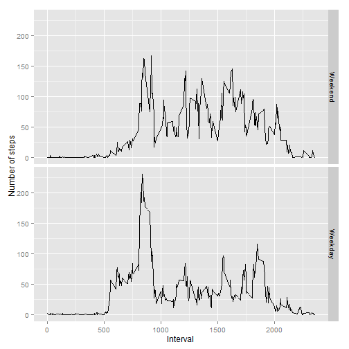

## Loading and preprocessing the data
Load the required libraries for the assignment  


```r
library(dplyr)
library(ggplot2)
```

Load the file and transform as needed, assuming  data is in current directory

```r
activity <- read.csv("activity.csv")
head(activity, n=10) ## Review of data
```

```
##    steps       date interval
## 1     NA 2012-10-01        0
## 2     NA 2012-10-01        5
## 3     NA 2012-10-01       10
## 4     NA 2012-10-01       15
## 5     NA 2012-10-01       20
## 6     NA 2012-10-01       25
## 7     NA 2012-10-01       30
## 8     NA 2012-10-01       35
## 9     NA 2012-10-01       40
## 10    NA 2012-10-01       45
```

```r
str(activity)
```

```
## 'data.frame':	17568 obs. of  3 variables:
##  $ steps   : int  NA NA NA NA NA NA NA NA NA NA ...
##  $ date    : Factor w/ 61 levels "2012-10-01","2012-10-02",..: 1 1 1 1 1 1 1 1 1 1 ...
##  $ interval: int  0 5 10 15 20 25 30 35 40 45 ...
```

```r
summary(activity)
```

```
##      steps                date          interval     
##  Min.   :  0.00   2012-10-01:  288   Min.   :   0.0  
##  1st Qu.:  0.00   2012-10-02:  288   1st Qu.: 588.8  
##  Median :  0.00   2012-10-03:  288   Median :1177.5  
##  Mean   : 37.38   2012-10-04:  288   Mean   :1177.5  
##  3rd Qu.: 12.00   2012-10-05:  288   3rd Qu.:1766.2  
##  Max.   :806.00   2012-10-06:  288   Max.   :2355.0  
##  NA's   :2304     (Other)   :15840
```


## What is mean total number of steps taken per day?

1. Calculating the total number of steps taken per day


```r
totsteps <- activity %>% group_by(date) %>% summarize(totalsteps = sum(steps, na.rm=T))
head(totsteps, n=10)
```

```
## Source: local data frame [10 x 2]
## 
##          date totalsteps
##        (fctr)      (int)
## 1  2012-10-01          0
## 2  2012-10-02        126
## 3  2012-10-03      11352
## 4  2012-10-04      12116
## 5  2012-10-05      13294
## 6  2012-10-06      15420
## 7  2012-10-07      11015
## 8  2012-10-08          0
## 9  2012-10-09      12811
## 10 2012-10-10       9900
```

2. Plotting a histogram of total number of steps taken per day


```r
qplot(totalsteps, data=totsteps, 
      xlab="Total Steps taken in a Day", ylab="No. of Days")
```

```
## stat_bin: binwidth defaulted to range/30. Use 'binwidth = x' to adjust this.
```

 

3. Calculating mean and median of total number of steps taken per day


```r
mean(totsteps$totalsteps, na.rm=TRUE)
```

```
## [1] 9354.23
```

```r
median(totsteps$totalsteps, na.rm=T)
```

```
## [1] 10395
```

## What is the average daily activity pattern?

1. Calculating the average number of steps taken for each of the 5 minute interval across all days


```r
avgsteps <- activity %>% group_by(interval) %>% summarize(avgsteps = mean(steps, na.rm=T))
qplot(interval, avgsteps, data=avgsteps, geom = c("line"), 
      xlab = "Time Interval (24 hr clock)", ylab = "Average No. Steps Taken")
```

 

2. Identifying the 5 minute interval with maximum number of steps taken, on average across all the days


```r
avgsteps[avgsteps$avgsteps == max(avgsteps$avgsteps), ]
```

```
## Source: local data frame [1 x 2]
## 
##   interval avgsteps
##      (int)    (dbl)
## 1      835 206.1698
```

**Observation**  
The time interval of 835 i.e. 8:35 AM has the maximum activity in terms of no. of steps (206 steps) taken by the subject on average across all days.

## Imputing missing values

1. Calculating total number of missing values i.e. rows with NA value for steps


```r
table(is.na(activity$steps))
```

```
## 
## FALSE  TRUE 
## 15264  2304
```

**Observation**  
There are 2305 records with missing values out of the total of 17568 records

2. Strategy to be adopted to fill missing value - to impute the average steps of the 5 minute interval across all the day,  in place of missing value

3. Calculating revised total steps after imputing the avg. steps of 5 minute interval to original data set. We first create a copy of the activity dataset. For each of the missing value in this revised dataset, we impute the NA value with average of steps taken for that 5 minute interval from the avgsteps data set calculated earlier.


```r
activity2 <- activity
for (i in 1:17568) {
    if(is.na(activity2[i, "steps"])) {
        activity2[i, "steps"] <- avgsteps[avgsteps$interval == activity2[i, "interval"], "avgsteps"]
    }
}
head(activity2, n=10)
```

```
##        steps       date interval
## 1  1.7169811 2012-10-01        0
## 2  0.3396226 2012-10-01        5
## 3  0.1320755 2012-10-01       10
## 4  0.1509434 2012-10-01       15
## 5  0.0754717 2012-10-01       20
## 6  2.0943396 2012-10-01       25
## 7  0.5283019 2012-10-01       30
## 8  0.8679245 2012-10-01       35
## 9  0.0000000 2012-10-01       40
## 10 1.4716981 2012-10-01       45
```

4. Recalculate the total number of steps taken per day with imputed dataset and replotting the histogram


```r
totsteps2 <- activity2 %>% group_by(date) %>% summarize(totalsteps = sum(steps, na.rm=T))
head(totsteps2, n=10)
```

```
## Source: local data frame [10 x 2]
## 
##          date totalsteps
##        (fctr)      (dbl)
## 1  2012-10-01   10766.19
## 2  2012-10-02     126.00
## 3  2012-10-03   11352.00
## 4  2012-10-04   12116.00
## 5  2012-10-05   13294.00
## 6  2012-10-06   15420.00
## 7  2012-10-07   11015.00
## 8  2012-10-08   10766.19
## 9  2012-10-09   12811.00
## 10 2012-10-10    9900.00
```

```r
qplot(totalsteps, data=totsteps2,  
      xlab="Total Steps taken in a Day", ylab="No. of Days")
```

```
## stat_bin: binwidth defaulted to range/30. Use 'binwidth = x' to adjust this.
```

 

```r
mean(totsteps2$totalsteps, na.rm=TRUE)
```

```
## [1] 10766.19
```

```r
median(totsteps2$totalsteps, na.rm=T)
```

```
## [1] 10766.19
```

** Observation**  
By imputing average of the 5 minute interval, the overall mean steps taken per day has increased by about 15% by filling in missing value. The median steps remain more or less same around 10766.  We also observe that both mean and median have collapsed to same value of 10766 steps! Given my current rudimentary statistics knowledge, I am unable to decipher why but hope to check it out later while refreshing my basic statistics for subsequent courses!

Also notice that there are several zero values in steps in time slots that normally have some activity or steps e.g. time interval between 1200 to 1300 (12 pm to 1 pm). The presence of these zero values has impact of dragging down the average and median total steps. One possible strategy could be to eliminate all activity data for days when all the time intervals are reporting 0 steps. This  needs to be invistigated further.

## Are there differences in activity patterns between weekdays and weekends?

1. Creating a new factor variable called 'daytype' to seggregate activity date between weekday and weekend, using weekend() and strptime() functions. 


```r
weekdaylist <- c("Monday", "Tuesday", "Wednesday", "Thursday", "Friday")
activity2$daytype <- factor((weekdays(strptime(activity2$date, "%Y-%m-%d")) %in% weekdaylist), 
                            levels = c(FALSE, TRUE), labels = c("Weekend", "Weekday"))
head(activity2, n=10)
```

```
##        steps       date interval daytype
## 1  1.7169811 2012-10-01        0 Weekday
## 2  0.3396226 2012-10-01        5 Weekday
## 3  0.1320755 2012-10-01       10 Weekday
## 4  0.1509434 2012-10-01       15 Weekday
## 5  0.0754717 2012-10-01       20 Weekday
## 6  2.0943396 2012-10-01       25 Weekday
## 7  0.5283019 2012-10-01       30 Weekday
## 8  0.8679245 2012-10-01       35 Weekday
## 9  0.0000000 2012-10-01       40 Weekday
## 10 1.4716981 2012-10-01       45 Weekday
```

2. Recalculate the average steps taken in 5 minute interval across weekend and weekday. Plotting the activity pattern over weekend and weekday as per format required for the assessment.


```r
avgsteps2 <- activity2 %>% group_by(interval, daytype) %>% summarize(avgsteps = mean(steps, na.rm=T))
head(avgsteps2, n=10)
```

```
## Source: local data frame [10 x 3]
## Groups: interval [5]
## 
##    interval daytype    avgsteps
##       (int)  (fctr)       (dbl)
## 1         0 Weekend 0.214622642
## 2         0 Weekday 2.251153040
## 3         5 Weekend 0.042452830
## 4         5 Weekday 0.445283019
## 5        10 Weekend 0.016509434
## 6        10 Weekday 0.173165618
## 7        15 Weekend 0.018867925
## 8        15 Weekday 0.197903564
## 9        20 Weekend 0.009433962
## 10       20 Weekday 0.098951782
```

```r
qplot(interval, avgsteps, data = avgsteps2, facets = daytype~., geom = c("line"), xlab = "Interval", ylab = "Number of steps")
```

 

**Observation**  
There is a noticably increased activity of the subject between 10 to 20 hours (i.e 10 AM to 8 PM) on weekends compared to weekday. This could possibly due to subject being white collar worker with sedentary working habits. This needs to be invistigated further.


